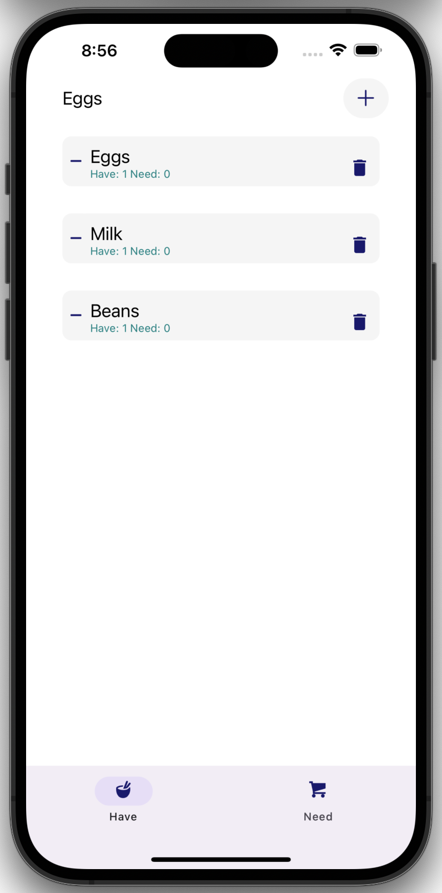

# chicken-stock

A simple app to keep your food in stock! 🐓

## Screenshot



## Running

Install [Expo](https://docs.expo.dev/) and install [Expo Go](https://docs.expo.dev/get-started/expo-go/) on your phone for fast reload.

```shell
npm install
npm start
# scan the QR code  on your phone to open the app in Expo Go
# OR open simulators
# press a | open Android
# press i | open iOS simulator
```

## Useful links

[Primary Inspiration](https://dev.to/reenydavidson/building-a-to-do-list-with-react-native-and-styled-components-2148) with [code: native-todo](https://github.com/ReenyDavidson/native-todo/blob/main/Components/TodoList.js)

- [Expo](https://expo.dev/)
- [FlatList](https://reactnative.dev/docs/flatlist)
- [Expo Icons](https://icons.expo.fyi/), esp Entypo
- [React Native docs](https://reactnative.dev/docs/components-and-apis)
- [Tab navigation](https://reactnavigation.org/docs/tab-based-navigation/)
- [styled-components](https://styled-components.com/)

One-time references:

- [Setup TypeScript](https://docs.expo.dev/guides/typescript/)
- [TextView + value](https://stackoverflow.com/a/75353575/158886)